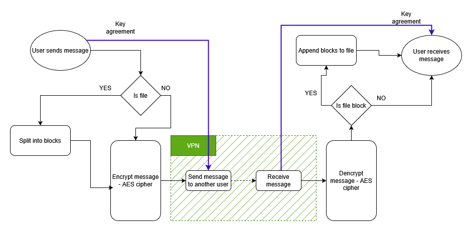

# DISECOM – DIStributed SECure COMmunication  
**By Zacordoneț Andrei & Zaharia Teodor-Ștefan**

## Description

**DISECOM** is our implementation of a distributed system for secure, bidirectional communication between stations via the TCP protocol. Message and file transmission is done **point-to-point (peer-to-peer)** using **symmetric encryption**, with key exchange secured through **AES (Advanced Encryption Standard)** and **Diffie-Hellman** algorithms.

To create a secure and private communication network, we use **Tailscale**, a tool for setting up a private virtual network (VPN). This eliminates the need to expose public ports or rely on public IP addresses.

---

## Project Architecture



---

## Algorithms Used

### AES (Advanced Encryption Standard)

We implemented the **Rijndael algorithm** (better known as AES), following the **NIST proposal from May 9, 2023**. This algorithm was chosen for its widespread adoption and high level of security, especially through its key scheduling system.

### Diffie-Hellman Key Exchange

This algorithm is used to securely generate a shared private key between two clients using individual secrets. The security of this method is based on the mathematical difficulty of factoring large numbers (One-Way Function).

---

## Implementation Details

- **Language:** Python  
- **Communication:** TCP sockets  
- **Topology:** Both stations have symmetric roles—they can both send and receive messages and files  
- **AES:** Implemented using bare Python  
- **Key Exchange:** Based on the Diffie-Hellman protocol  
- **Concurrency:** Handled via multithreading and locking mechanisms  
- **Interface:** Built using `tkinter` for a simple and native GUI  
- **VPN:** Utilizes Tailscale for peer discovery and NAT traversal  

---

## ️ How to Run

To run the application it's necessary to create your own [Tailscale](https://tailscale.com/) network. To add all requirements, besides having Python installed, run:
```bash
pip install requirements.txt
```

Then execute the main script using the following command:
```bash
py station_gui.py
```
---

## References

- [Diffie–Hellman key exchange – Wikipedia](https://en.wikipedia.org/wiki/Diffie%E2%80%93Hellman_key_exchange)  
- [Advanced Encryption Standard (AES)](https://en.wikipedia.org/wiki/Advanced_Encryption_Standard)  
- [NIST SP 800-38A: Block Cipher Modes of Operation](https://nvlpubs.nist.gov/nistpubs/Legacy/SP/nistspecialpublication800-38a.pdf)  
- [Rijndael Algorithm Animation](https://www.cs.usfca.edu/~galles/visualization/AES.html)  
- [PKCS Padding](https://datatracker.ietf.org/doc/html/rfc5652#section-6.3)  
- [tkinter](https://docs.python.org/3/library/tkinter.html)  
- [Tailscale](https://tailscale.com/)  
- [TCP, UDP, HTTP, WebSocket – AnyOneCanCode](https://medium.com/@AnyOneCanCode)

